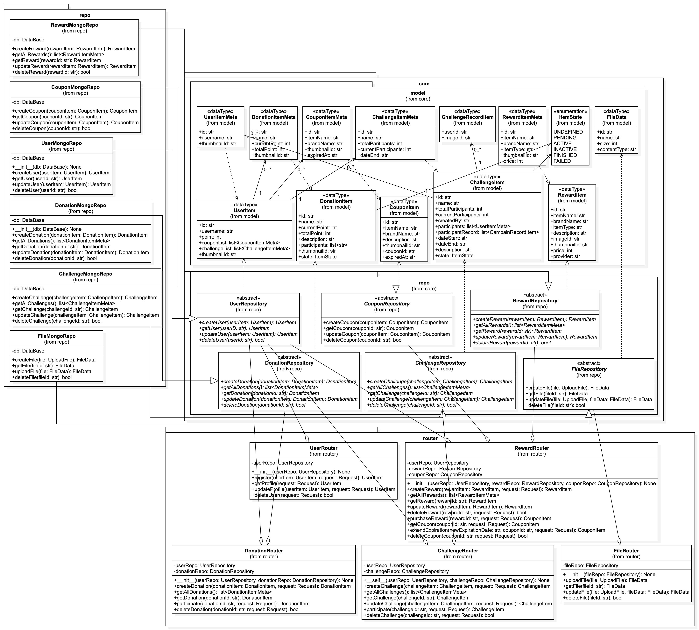

# 환경발자국 (Eco Footprint)
- 환경보호를 실천하면서 리워드를 받을 수 있는 걷기 리워드앱
- 서울시립대학교 캡스톤디자인 팀 프로젝트
- React Native의 Expo 프레임워크를 이용하여 개발하였음.
- React Native는 크로스 플랫폼 개발을 지원하지만, IOS 개발환경 부족으로 인해 android 플랫만 개발하였음.

## 데모


https://github.com/user-attachments/assets/88d01592-effe-4e4f-937d-d06be924b3e5


## 릴리즈
[Android v1.0.0](https://github.com/k03302/eco-footprint-client/releases/tag/v1.0.0)
## 빌드 방법
- 환경변수 설정
```
// .env파일 내에 항목에 따라 값을 작성
EXPO_PUBLIC_SERVER_ROOT // 서버 주소
EXPO_PUBLIC_SERVER_API // 서버 api 주소
EXPO_PUBLIC_REDIRECT_URI // 서버 로그인 리다이렉트 주소
EXPO_PUBLIC_SECRET // 서버와 공유하는 비밀키
EXPO_PUBLIC_KAKAO_REST_API_KEY // 카카오 로그인 api 키
EXPO_PUBLIC_ADMOB_REWARDED_AD_KEY // 애드몹 앱 키
```

- Expo Development Build
```
install npm
npx expo prebuild
npx expo run:android
```

- Eas Build (Release Build)
```
install npm
npm install eas-cli
eas login
eas build --profile production --profile android
```

## 실행 방법
```
npx expo start
```

# 문서

## 1.프로젝트 제안서
[프로젝트 제안서](docs/1.project_proposal.pdf)

## 2.경쟁력 분석서
[경쟁력 분석서](docs/2.competitive_analysis.pdf)

## 3.개념 설계서
[개념 설계서](docs/3.conceptual_design.pdf)

### 설계사양
1. 로그인 및 회원가입 기능
   - 본 서비스는 개인별 정보의 유지를 필요로 하므로 무료 회원제를 채택한다.
   - 우선적으로 Google, KakaoTalk 등 소셜 로그인을 통해 로그인 및 회원가입 절차를 간편화한다.(추후 자체적인 회원 가입 시스템 도입이 가능하나, 우선순위는 낮다.)
   - 처음 앱을 실행 시 로그인을 해야 하며, 회원이 아니라면 회원 가입을 진행한다.
   - 앱에서 로그인 내역을 기억해서 다음 접속 시 자동 로그인을 하여 사용성을 높인다.
2. 도보이동 위치 수집 기능
   - 사용자의 위치 정보를 바탕으로 일정 시간마다 사용자가 도보로 이동 중인지 아닌지를 판별한다.

   - 사용자가 도보로 이동 중이면 해당 위치를 저장한다.
   - 저장된 도보이동 위치 정보를 바탕으로 환경발자국 영역을 계산한다.
   - 환경발자국 영역은 아래와 같이 정의된다.

3. 지도 표시 기능
   - 사용자는 환경발자국 및 아이템이 증강된 지도를 확인할 수 있다. Google Maps API를 이용한다.
   - 환경발자국 내에 균일분포로 아이템이 생성된다.
4. 광고시청 및 포인트 획득 기능
   - 환경발자국 내의 아이템을 터치하면 포인트를 획득할 수 있다. 포인트는 상점에서 실물상품과 교환할 수 있다.
   - 아이템 터치 시 일정 확률로 추가적인 포인트를 받을 수 있고 환경모금에도 기여되는 광고보기 이벤트가 실행된다.
5. 포인트 교환 기능
   - 포인트로 구매할 수 있는 상품을 조회할 수 있다.
   - 획득한 포인트를 상품과 교환하면 바코드쿠폰 형식의 이미지를 다운로드 받을 수 있다.
6. 개인 프로필 확인 기능
   - 개인 프로필 화면에서 개인정보, 획득한 포인트, 탄소저감량, 쿠폰 구매 내역 등이 표시된다.
   - 사용자 환경설정 등 기타 옵션을 제공한다.
7. 환경 보호 모금 기능
   - 사용자가 환경 모금을 조회 및 참여할 수 있다.
   - 환경 모금 참여 시 해당 모금에 일정 금액이 기여되는 광고를 시청한다.
8. 환경 챌린지 기능
   - 사용자는 “쓰레기줍기, 텀블러 이용하기, 대중교통 이용하기” 등 사진으로 인증 가능한 환경 챌린지에 참여할 수 있다.
   - 사용자는 여러 명의 사용자로 구성된 환경 챌린지 방을 조회 및 참여할 수 있다.
   - 사용자는 매일 현장에서 즉석으로 찍은 사진으로 환경 활동을 인증한다.
   - 각 인증 사진은 환경 챌린지 방에 업로드되며, 사용자들이 서로 인증사진을 승인하고, 승인 완료 시 포인트를 받을 수 있다.
### 유즈케이스 다이어그램

### 액티비티 다이어그램

### 서버 클래스 다이어그램



## 4.상세 설계서
[상세 설계서](docs/4.detail_design.pdf)
### 아키텍처 다이어그램

### UI 프로토타입 흐름도


